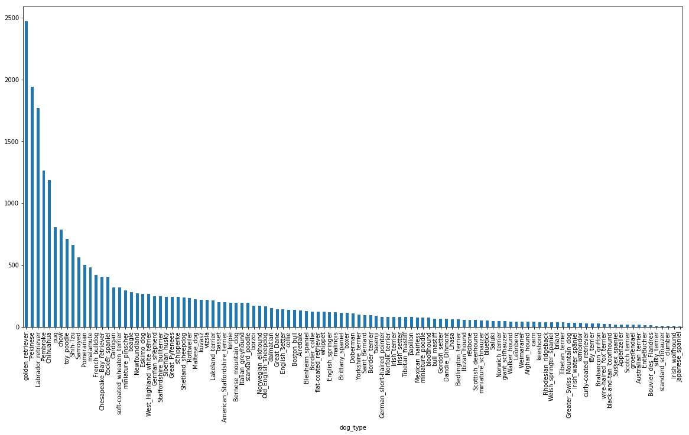
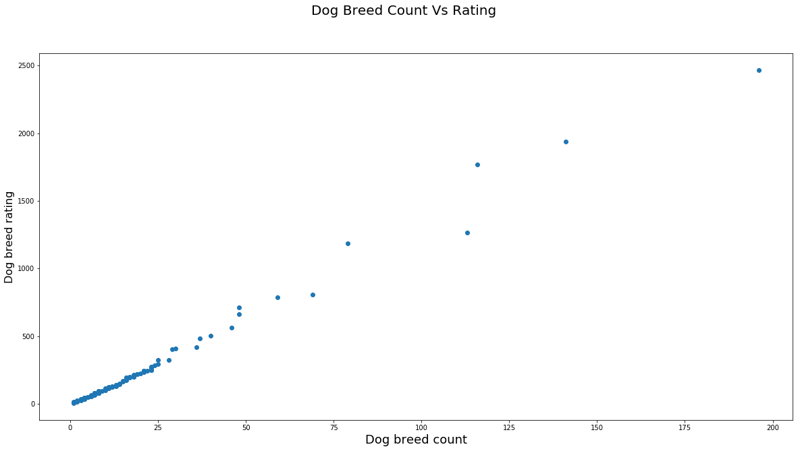
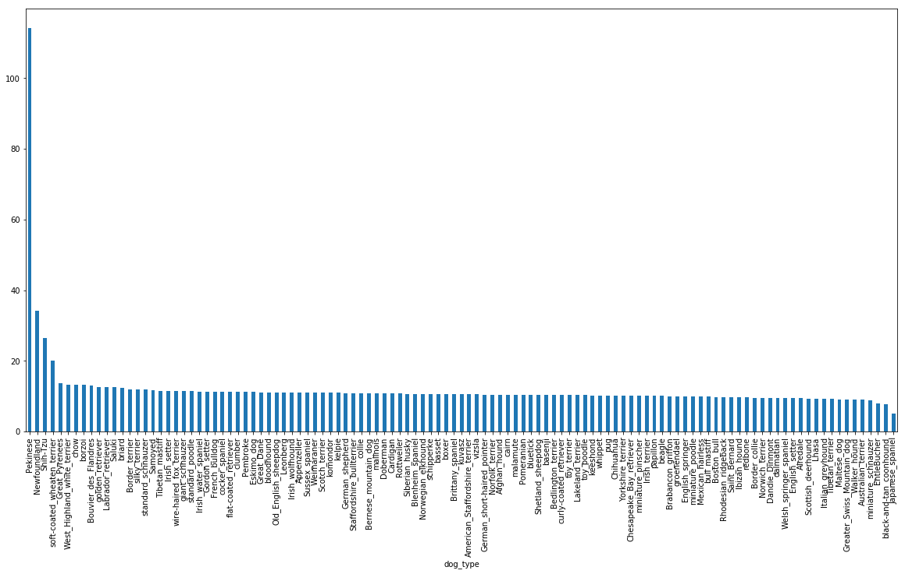
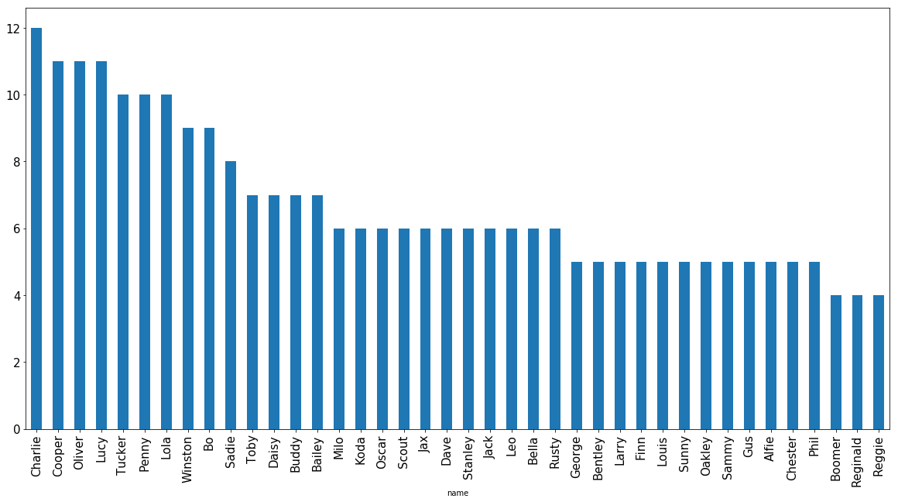
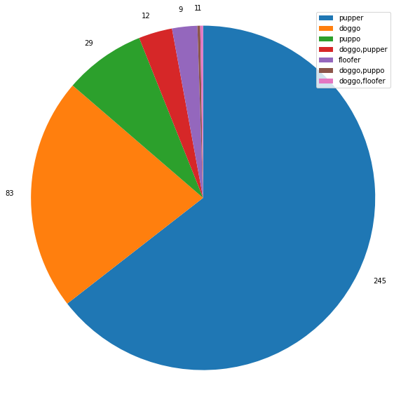

# Wrangle Twitter Data Report
## Introduction:
In this project data is gathered from three different sources: twitter data archive, udacity server, and twitter API. This gathered data is then merged together and accessed for cleaning. Necessary cleaning operations are performed. Finally exploratory data visualizations are produced to explore the cleaned data.

## Data Gathering:
1. Data from twitter archive was downloaded and Imported the twitter-archive-enhanced.csv datafile as twitter_data dataframe

2. Data from image_prediction.tsv file from udacity server was imported using requests library and given url and was saved as server_data dataframe

3. Data from twitter api was gathered by the access and consumer tokens and by using tweepy library.
## Data Access and Cleaning:
1. The data from twitter archive i.e. twitter_data dataframe's 'text' column has three variables: tweet text, rating, and image url. These three variables were separated using 're' python library and saved as individual columns: text, text_rating, image_url.
 2. The twitter_data dataframe's 'timestamp' column has two varibles:Date and time. These two variables were separated using python datetime library and saved as individual columns- Date, Time.
 3. In image_predictions.tsv file there are three columns p1, p2, p3 that represent the same meaning dog breed and can be reduced to one
 
### Quality issues:

1. The twitter archive data and data collected from twitter api were merged together as single dataframe. Merged twitter_data and api_data dataframes on tweet_id column using join function.

2. Merged combined_data dataframe (twitter achrive and api_data) with data gathered from udacity server (server_data dataframe). Now data collected from all three sources is in combined_data dataframe.

3. The datatype of rating_numerator was int64 it was changed to float

4. The datatype of tweet_id was int64 it was changed to object

5. Data from data dataframe was filtered and only those tweets were selected that has images. That is selected all the data for tweets who have media=photo

6. At some places rating_denominator was not equal to 10 and it was update to 10

7. At some places rating_numerator was greater than 1000 which did not make sence, hence tweets having rating_numerator <=15 selected

8. At some tweets twitter text ratings and given ratings in twitter-archive did not match. So, rating_numerator was updated to the ratings of twitter text

9.  Selected columns of interest. Deleted unwanted variables

10. Missing values were deleted from data dataframe

11. The name column value counts has none for 745 tweets and a for 75. This inaccurate information was deleted

## Data Visualization and Findings:
1.) A box plot was created to observe the minimum, maximum and mean ratings for all dog ratings. And it was observed that min rating was 0, max was 14 and mean was 12

2.) After grouping the data by type of dog breed and counting the number of dog, a bar plot was created to visualize the dog breed and its corresponding count of dogs. And it was observed that golden_retrriever has highest count of dogs

3.) After grouping the data by type of dog breed and summing the dog ratings, a bar plot was created to visualize the dog breed and its corresponding sum of ratings. And it was observed that golden_retrriever has highest summed ratings of dog

4.) A scatter plot was created to visualize the relationship between Dog rating and Count varibles. And was observed that there is a strong positive relationship, as the count increases so does the summed dog ratings.

5.) As there is positive relationship between count and summed rating, mean rating were considered. So, data was grouped by dog type and mean of its corresponding ratings were plotted. And it was observed that though golden_retriever had highest count and summed rating, hightest mean rating was given to Appenzeller

6.) Data was grouped by date of tweets and its tweet_id count was plotted and it was observed that highest tweets were reported during 2015-12 to 2016-02

7.) Data was grouped by dog name and its tweet_id count was plotted and it was observed that Tucker, Penny, charlie, Lucy, Cooper, Oliver are the common names given to dogs

8.) Data was grouped by dog name and its mean rating was plotted and it was observed the highest mean rated dog names were Clifford, lggy, kuyu, Laika, Smiley, Emmy, General,Doobert, Sundance, Cerment

